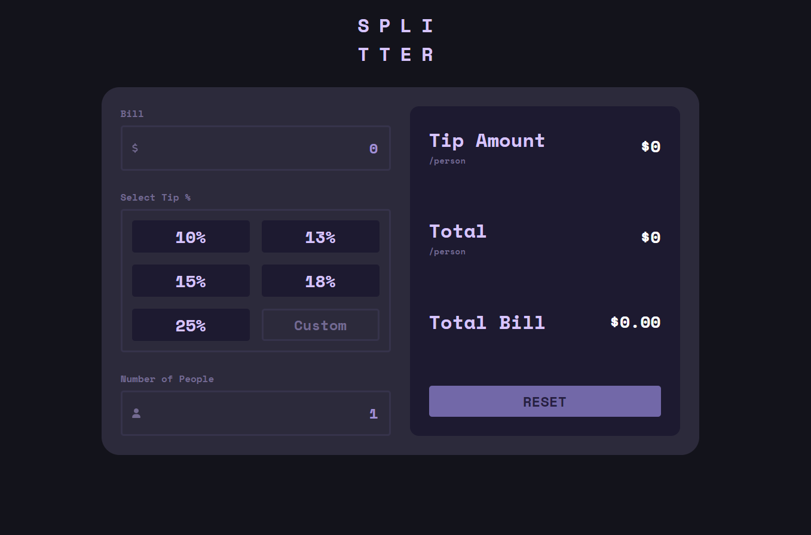

# Frontend Mentor - Tip calculator app solution

This is a solution to the [Tip calculator app challenge on Frontend Mentor](https://www.frontendmentor.io/challenges/tip-calculator-app-ugJNGbJUX). Frontend Mentor challenges help you improve your coding skills by building realistic projects.

## Overview

### The challenge

Users should be able to:

- View the optimal layout for the app depending on their device's screen size
- See hover states for all interactive elements on the page
- Calculate the correct tip and total cost of the bill per person

### Screenshot

### Links
- Live Site URL: [https://mv805.github.io/tip-calculator-app-react](https://mv805.github.io/tip-calculator-app-react)

## My process

### Built with

- Semantic HTML5 markup
- CSS custom properties
- Flexbox
- CSS Grid
- Mobile-first workflow
- [React](https://reactjs.org/) - JS library

**Note: These are just examples. Delete this note and replace the list above with your own choices**

### What I learned

I had fun building this little app and furthering my React skills. 

I experimented heavily with different ways of styling, utilizing modules and non module stylesheets. Things got very confusing very fast after trying to figure out if I was going to apply modules to each component, or style them all from one large sheet. 
